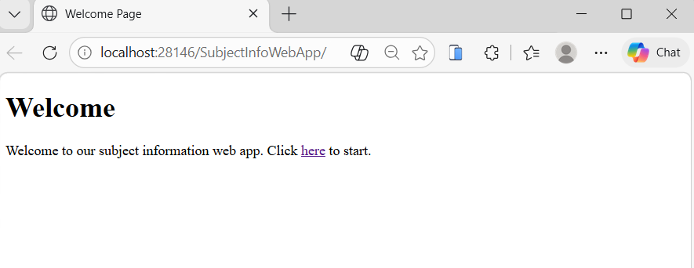
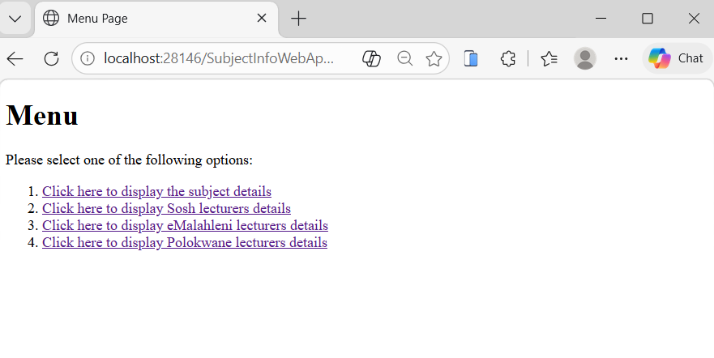
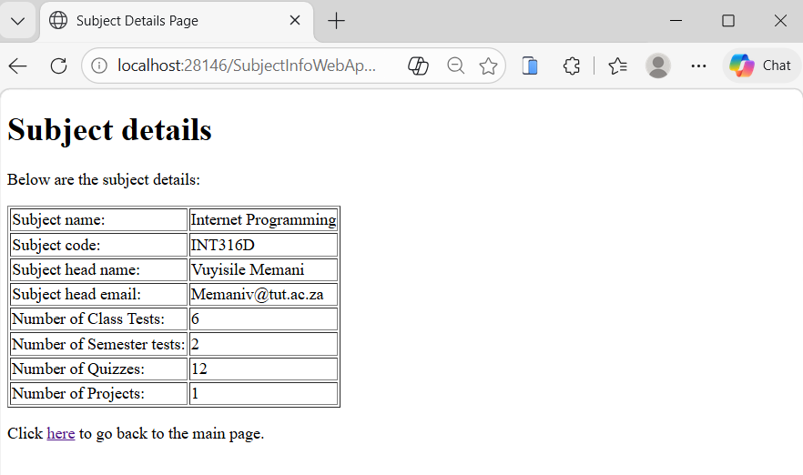
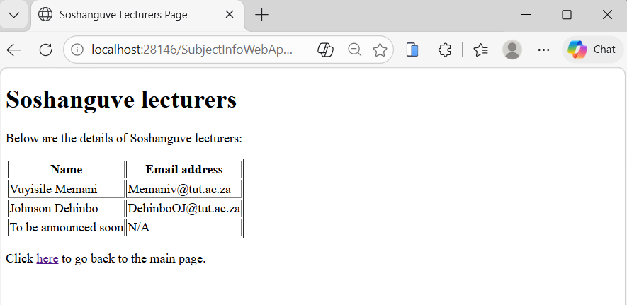

# SubjectInfoServletApp

A Java EE web application demonstrating the use of **ServletConfig** and **ServletContext** to manage local and global initialization parameters. Built using Servlets, JSP, and deployed on GlassFish.

---

##  Overview

This project was developed to demonstrate how Java Servlets handle initialization parameters:

* **ServletContext (Global Parameters)** → shared across the entire application
* **ServletConfig (Local Parameters)** → specific to individual servlets

The application displays subject information for **INT316D**, including:

* Subject name and code
* Subject head details
* Lecturer details for multiple campuses (Soshanguve, eMalahleni, Polokwane)

---

## 📸 Screenshots

| Screenshot                                          | Description                          |
| --------------------------------------------------- | ------------------------------------ |
|             | Welcome page (`index.html`)          |
|                   | Menu page with navigation            |
|  | Subject details using ServletContext |
|         | Lecturer details using ServletConfig |

---

## 🛠️ Technologies Used

* Java 8
* Java EE (Servlets, JSP)
* HTML5
* GlassFish Server 4.1.1
* NetBeans IDE

>  IDE-specific build files and compiled files are excluded using `.gitignore`.

---

##  Features

* Displays subject details using **ServletContext**
* Displays lecturer details using **ServletConfig**
* Multiple servlet controllers for different campuses
* JSP pages for dynamic content rendering
* Clean separation between logic (Servlets) and view (JSP)

---

##  Project Structure

```
SubjectInfoServletApp/
│
├── src/java/za/ac/tut/web/
│   ├── SubjectDetailsServlet.java
│   ├── SoshLecturersServlet.java
│   ├── PolokwaneLecturersServlet.java
│   ├── eMalahleniLecturersServlet.java
│
├── web/
│   ├── index.html
│   ├── menu.html
│   ├── subject_details.jsp
│   ├── sosh_lecs.jsp
│   ├── pokwane_outcome.jsp
│   ├── emalahleni_outcome.jsp
│
├── WEB-INF/
│   └── web.xml
│
├── .gitignore
├── README.md
```

---

##  Key Learning Outcomes

* Understanding the **Servlet lifecycle**
* Differentiating between **ServletConfig and ServletContext**
* Using **web.xml (Deployment Descriptor)** for configuration
* Handling HTTP requests using Servlets
* Integrating Servlets with JSP for dynamic content

---

##  How to Run

1. Clone the repository:

   ```bash
   git clone https://github.com/LungeloMK/SubjectInfoServletApp.git
   ```

2. Open the project in **NetBeans**

3. Configure **GlassFish Server 4.1.1**

4. Run the project

5. Open in browser:

   ```
   http://localhost:8080/SubjectInfoServletApp/
   ```

---

##  Notes

* This project is based on a servlet exercise demonstrating real-world use of initialization parameters.
* Global data is configured using `<context-param>` in `web.xml`
* Local servlet data is configured using `<init-param>`

---

##  Author

**Lungelo**
